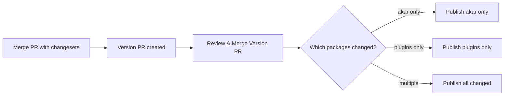

# Changesets Release Workflow Guide

This monorepo uses [Changesets](https://github.com/changesets/changesets) to manage versioning and publishing of packages. Here's how it works:

## 📦 Packages in this Monorepo

- `akar` - Core Vue UI components
- `plugins` - Plugins for akar
- `pohon-ui` - UI Library powered by Vue & UnoCSS
- `unocss-preset-vinicunca` - UnoCSS preset

## 🚀 How Changesets Work

### **No More Git Tags!** 
With Changesets, you **don't need to create git tags manually**. The workflow automatically:
1. Tracks changes per package
2. Creates version PRs
3. Publishes only changed packages
4. Creates GitHub releases with proper tags

## 📝 Developer Workflow

### 1. Make Your Changes
Work on your feature/fix in any package:
```bash
cd packages/core
# make changes...
```

### 2. Add a Changeset
When you're ready to commit, add a changeset describing your changes:

```bash
pnpm changeset
```

This interactive CLI will ask:
1. **Which packages changed?** Select the packages you modified
2. **What type of change?** 
   - `patch` - Bug fixes (1.0.0 → 1.0.1)
   - `minor` - New features (1.0.0 → 1.1.0)
   - `major` - Breaking changes (1.0.0 → 2.0.0)
3. **Summary** - Describe your changes

This creates a markdown file in `.changeset/` directory.

### 3. Commit Everything
```bash
git add .
git commit -m "feat: add new button variant"
git push
```

### 4. Create a Pull Request
Open a PR to `main` branch. The CI will:
- Build all packages
- Run tests
- Check for changesets (warn if missing)

## 🔄 Release Process

### Automated via GitHub Actions

When PRs with changesets are merged to `main`:

1. **Changesets Action** automatically:
   - Detects which packages have changesets
   - Creates/updates a "Version Packages" PR
   - Bumps versions based on changesets
   - Updates CHANGELOGs

2. **Review the Version PR**:
   - Check the version bumps are correct
   - Review the CHANGELOG entries
   - Merge when ready to release

3. **Publishing Happens Automatically**:
   - When the Version PR is merged
   - GitHub Actions will:
     - Build all packages
     - Publish changed packages to npm
     - Create GitHub releases with tags like:
       - `akar@1.11.1`
       - `pohon-ui@1.0.1`

## 🎯 Only Changed Packages Are Released

Changesets is smart! If you only change `akar`, only `akar` will be published. The workflow:



## 🛠️ Manual Commands

### Add a changeset
```bash
pnpm changeset
```

### Version packages (usually done by GitHub Actions)
```bash
pnpm version
```

### Publish packages (usually done by GitHub Actions)
```bash
pnpm release
```

## 📋 Changeset File Example

After running `pnpm changeset`, a file like `.changeset/brave-lions-dance.md` is created:

```markdown
---
"akar": minor
---

Add new button variant with improved accessibility
```

## 🔐 Required Secrets

Make sure these are set in GitHub repository settings:

- `GITHUB_TOKEN` - Automatically provided by GitHub
- `VINICUNCA_NPM_TOKEN` - Your npm token for publishing

## 💡 Best Practices

1. **Always add changesets** when making changes to packages
2. **Use semantic versioning correctly**:
   - `patch` - Backwards compatible bug fixes
   - `minor` - Backwards compatible new features
   - `major` - Breaking changes
3. **Write clear changeset summaries** - they become CHANGELOG entries
4. **One changeset per logical change** - makes reviewing easier
5. **Review Version PRs carefully** before merging

## 🔍 Package-Specific Workflows

### If you only change `akar`:
```bash
# 1. Make changes in packages/core
# 2. Add changeset
pnpm changeset
# Select: akar (patch/minor/major)
# 3. Commit and push
```

### If you change multiple packages:
```bash
# 1. Make changes in multiple packages
# 2. Add changeset
pnpm changeset
# Select: akar, plugins (both)
# Choose versions for each
# 3. Commit and push
```

## 🚨 Troubleshooting

### "No changeset found" warning on PR
- Run `pnpm changeset` to add a changeset
- Commit the generated file

### Publishing fails
- Check npm token is valid
- Ensure `publishConfig.access: "public"` in package.json
- Verify package names aren't taken on npm

### Version PR not created
- Ensure changesets were committed to main
- Check GitHub Actions logs
- Verify `GITHUB_TOKEN` has write permissions

## 📚 Resources

- [Changesets Documentation](https://github.com/changesets/changesets)
- [Changesets Action](https://github.com/changesets/action)
- [Semantic Versioning](https://semver.org/)
